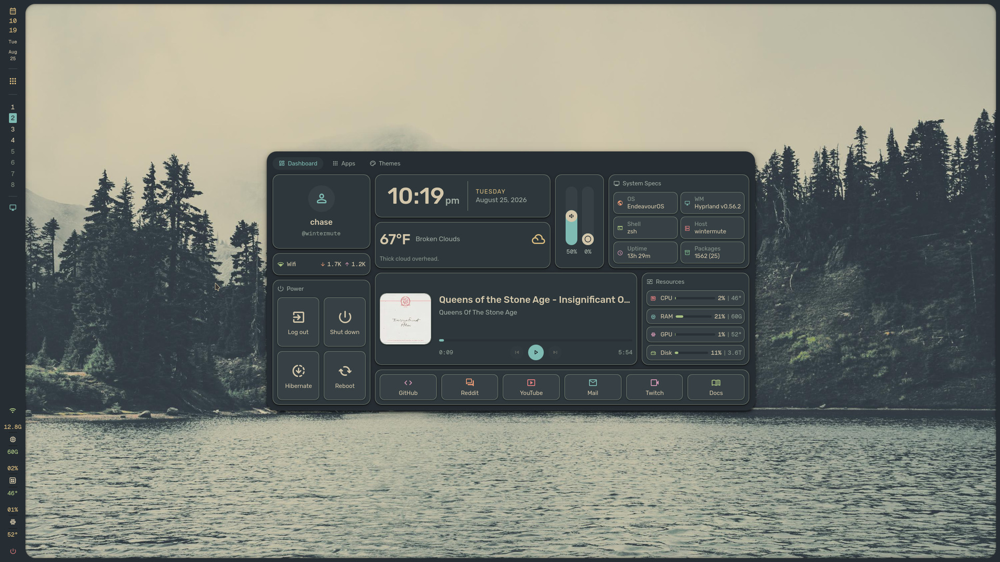

# dotfiles

A single-monitor Hyprland desktop on Arch, with a custom shell written from
scratch in Quickshell (QML) — bar, notifications, launcher, dashboard, power
menu — and a theme switcher that repaints the shell and the apps around it
from one JSON file.



---

## What's in here

| | |
|---|---|
| **WM** | Hyprland 0.56.2, configured in **Lua** (`hyprland.lua`) |
| **Shell** | Quickshell 0.3.1 (`quickshell-git`) — ~60 QML files, no external QML deps |
| **Terminal** | Konsole |
| **Themes** | 6, hot-swappable at runtime, no restart |
| **Wallpaper** | hyprpaper, swapped by the theme |

### The shell

- **Bar** — vertical, left edge. Clock, workspaces, active window, tray, status
  icons, RAM/CPU/GPU meters, power.
- **Dashboard** (`SUPER+SPACE`) with three pages:
  - *Info*: profile, network, clock, weather, media (MPRIS), volume/brightness
    sliders, system specs, resource graphs, quick links, power actions.
  - *Apps* (`SUPER+D`): the launcher, with search and themed icons.
  - *Themes*: the color picker — no shortcut, reached through the tab strip.
- **Notifications** — popup windows, click-to-dismiss, expandable.

Services are singletons under `quickshell/services/` — each owns exactly one
data source (`SysUsage` is the *sole* poller for cpu/gpu/ram/disk; the bar and
the dashboard both read from it rather than polling twice).

---

## Theming

Themes are plain JSON in [`themes/`](themes/) — about 22 raw colors, a
wallpaper, and a couple of flags:

```json
{
  "name": "everforest-dark",
  "label": "Everforest Dark (Hard)",
  "light": false,
  "wallpaper": "wallpapers/everforest_1.jpg",
  "red": "#e67e80", "green": "#a7c080", ...
  "background": "#272e33", "foreground": "#d3c6aa", ...
  "apps": { "konsoleScheme": "Everforest Dark Hard", "vscodeTheme": "..." }
}
```

`services/Colors.qml` maps those raw colors onto the full Material 3 role set,
so a theme file never spells out an `m3*` role and still gets all 53 for free.
Setting `"flat": true` switches every shadow in the shell off — plus Hyprland's
window shadow and blur — and lets outlines do the separating instead.

Shipped: Gruvbox Material (dark/light), Everforest (dark hard/light), Paperwhite
(dark/light — flat, monochrome, e-ink-ish).

### Downstream apps

Picking a theme on the dashboard's Themes page also runs
[`scripts/theme-apply.sh`](scripts/theme-apply.sh), which exports every color
as `THEME_<UPPER_SNAKE>` and sources each generator in
[`scripts/theme/`](scripts/theme/):

| Generator | Does | Applies |
|---|---|---|
| `konsole.sh` | rewrites `chase.profile`'s `ColorScheme`; derives a `.colorscheme` when the theme names none | new tabs |
| `vscode.sh` | rewrites `workbench.colorTheme` (JSONC-safe, no jq) | live |
| `zathura.sh` | generates `zathurarc.theme`, included from `zathurarc` | next launch |
| `qtgtk.sh` | writes a KDE `.colors` + `plasma-apply-colorscheme`; GTK follows | live |
| `firefox.sh` | **stub by choice** — needs a pref flip and a full restart | — |

### Adding a theme

1. Drop a JSON file in `themes/` and a wallpaper in `wallpapers/`.
2. Optionally add an `apps` block naming existing artifacts (a Konsole scheme, a
   VS Code theme). `null` means "derive it" — hand-curated schemes are never
   overwritten.
3. It appears in the dashboard on next shell reload. No code changes.

> Generated files carry a `# GENERATED by …` header — `konsole/*.colorscheme`
> for uncurated themes and `zathura/zathurarc.theme` are rewritten on every
> switch. Edit the theme JSON, not those.

---

## Install

```bash
# Arch / EndeavourOS
yay -S hyprland hyprpaper hyprpolkitagent quickshell-git \
       konsole dolphin zathura zathura-pdf-mupdf \
       ddcutil jq curl gnome-keyring grim

# fonts
yay -S ttf-rubik otf-geist-mono-nerd ttf-material-symbols-variable-git

# theme bits
yay -S gruvbox-plus-icon-theme-git capitaine-cursors
```

```bash
git clone https://github.com/<you>/dotfiles ~/dotfiles
ln -sf ~/dotfiles/hypr      ~/.config/hypr
ln -sf ~/dotfiles/quickshell ~/.config/quickshell
ln -sf ~/dotfiles/konsole   ~/.local/share/konsole
ln -sf ~/dotfiles/zathura   ~/.config/zathura
```

Then log into Hyprland — the shell autostarts. To iterate on it, run it in the
foreground so QML errors print:

```bash
quickshell -p ~/.config/quickshell
```

Restarting Quickshell is safe and doesn't touch the Hyprland session. It also
hot-reloads on file write.

### Optional: weather

The dashboard's weather card needs an [OpenWeather](https://openweathermap.org)
key, read at runtime from a file **outside this repo** so it is never committed:

```bash
install -m600 /dev/null ~/.config/openweather.key
printf '%s' 'YOUR_KEY' > ~/.config/openweather.key
```

Set your city id in `quickshell/config/Config.qml` → `weather.cityId`.
Responses cache to `~/.cache/quickshell-weather.json` and are replayed on a
failed fetch, so the card degrades quietly offline.

---

## Keybinds

`SUPER` is the mod.

| | |
|---|---|
| `SPACE` / `D` / `P` | dashboard / launcher / session menu |
| `Return` / `SHIFT+Return` | terminal / browser |
| `SHIFT+F` / `SHIFT+V` | file manager / VS Code |
| `Q` / `M` | close window / exit Hyprland |
| `F` / `V` | fullscreen / float |
| `←↑↓→` | focus by direction (`SHIFT` to move the window) |
| `1`–`0` | workspace (`SHIFT` to send the window there) |
| scroll | cycle workspaces |
| `LMB` / `RMB` drag | move / resize window |

Each shell shortcut toggles: pressing it on its own page closes the dashboard,
pressing it from the other page switches pages.